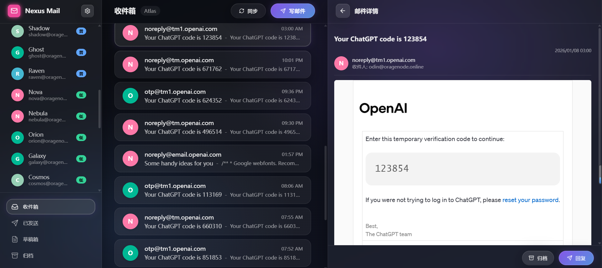

# Nexus Mail Admin Dashboard

统一邮件管理控制台 - 用于管理多个邮箱账号的 Web 应用。



## 功能

- 📧 多账号邮件管理
- 🔄 IMAP 邮件同步
- ✉️ 发送邮件 (SMTP)
- 🏷️ 自定义标签系统
- 🌙 深色/浅色主题
- 📱 响应式设计

## 技术栈

- **框架**: Next.js 16 (App Router)
- **数据库**: SQLite + Prisma ORM
- **样式**: CSS Variables + Framer Motion
- **邮件**: ImapFlow + Nodemailer

## 快速开始

### 1. 安装依赖

```bash
npm install
```

### 2. 配置环境变量

```bash
cp .env.example .env
```

### 3. 初始化数据库

```bash
npx prisma generate
npx prisma db push
```

### 4. 启动开发服务器

```bash
npm run dev:all
```

访问 <http://localhost:3000>

## 开发文档

- [开发规则](./docs/RULES.md)
- [开发流程](./docs/WORKFLOWS.md)
- [Bug 记录](./docs/BUGS_AND_SOLUTIONS.md)

## Docker 部署

参考 [部署文档](./docs/DEPLOYMENT.md)

```bash
docker compose up -d --build
```

## 环境变量

| 变量 | 说明 | 默认值 |
|------|------|--------|
| `DATABASE_URL` | SQLite 数据库路径 | `file:./dev.db` |
| `IMAP_HOST` | IMAP 服务器地址 | `localhost` |

## 项目结构

```
admin-dashboard/
├── app/                 # Next.js App Router
│   ├── api/            # API 路由
│   └── page.tsx        # 主页面
├── prisma/             # 数据库模型
├── docs/               # 文档
└── Dockerfile          # Docker 配置
```

## License

MIT
