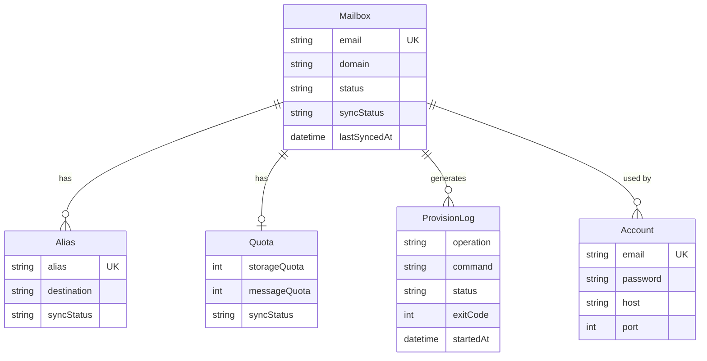

# P1 Provisioning Agent 设计文档

> **版本**: v1.0  
> **作者**: Admin Dashboard Team  
> **日期**: 2026-01-14  
> **优先级**: P1（高优先级）

---

## 📋 执行摘要

### 背景

当前 admin-dashboard 与 docker-mailserver 的账号管理存在双系统问题：

- **admin-dashboard**: 使用 Prisma + SQLite 存储账号信息（仅用于 IMAP/SMTP 连接）
- **docker-mailserver**: 使用 `setup email add` CLI 管理真实邮箱账号

两者需要手动同步，容易出错且不可审计。

### 目标

设计并实现 **Provisioning Agent**，将 docker-mailserver 账号管理产品化：

1. ✅ **统一账号管理**: UI 作为权威数据源，自动下发到 docker-mailserver
2. ✅ **双向同步**: 支持从 docker-mailserver 回读现有账号
3. ✅ **操作审计**: 所有账号变更操作可追溯
4. ✅ **幂等性保证**: 支持重试和失败回滚

### 范围

本设计文档覆盖：

- ✅ 账号管理（创建/删除/禁用/重置密码）
- ✅ 别名管理（添加/删除别名）
- ✅ 配额管理（设置邮箱存储配额）
- ✅ 同步机制（UI → docker-mailserver 下发，docker-mailserver → UI 回读）
- ⚠️ **不包含**: DKIM 密钥管理（留待 P2）、域名管理（留待 P3）

---

## 一、架构设计

### 1.1 整体架构

```
┌─────────────────────────────────────────────────────────────┐
│                     Admin Dashboard (Next.js)               │
│  ┌──────────────┐  ┌──────────────┐  ┌───────────────────┐ │
│  │ UI (React)   │  │ API Routes   │  │ Provisioner       │ │
│  │ - 账号管理   │→ │ /api/        │→ │ Service Layer     │ │
│  │ - 别名管理   │  │ provision/*  │  │ - 命令构建        │ │
│  │ - 配额管理   │  │              │  │ - 幂等性控制      │ │
│  └──────────────┘  └──────────────┘  └───────────────────┘ │
│                            ↓                    ↓            │
│                   ┌─────────────────────────────────┐        │
│                   │  Prisma + SQLite/Postgres       │        │
│                   │  - Account 表                   │        │
│                   │  - Mailbox 表 (新增)            │        │
│                   │  - Alias 表 (新增)              │        │
│                   │  - ProvisionLog 表 (新增)       │        │
│                   └─────────────────────────────────┘        │
└───────────────────────────────────┬─────────────────────────┘
                                    │ Docker exec
                                    ↓
┌─────────────────────────────────────────────────────────────┐
│              docker-mailserver (容器)                        │
│  ┌──────────────────────────────────────────────────────┐  │
│  │  CLI: setup email add/del/update                      │  │
│  │       setup alias add/del                             │  │
│  │       setup quota set                                 │  │
│  └──────────────────────────────────────────────────────┘  │
│                            ↓                                 │
│  ┌──────────────────────────────────────────────────────┐  │
│  │  /tmp/docker-mailserver/                             │  │
│  │  - postfix-accounts.cf  (账号列表)                   │  │
│  │  - postfix-virtual.cf   (别名配置)                   │  │
│  │  - dovecot-quotas.cf    (配额配置)                   │  │
│  └──────────────────────────────────────────────────────┘  │
└─────────────────────────────────────────────────────────────┘
```

### 1.2 组件职责

| 组件 | 职责 | 技术栈 |
|------|------|--------|
| **UI Layer** | 账号/别名/配额管理界面 | React + Next.js |
| **API Routes** | HTTP 接口，参数校验，调用 Provisioner | Next.js API Routes |
| **Provisioner Service** | 封装 docker-mailserver CLI，幂等性控制 | TypeScript + Node.js |
| **Database** | 存储账号、别名、配额、操作日志 | Prisma + SQLite/Postgres |
| **docker-mailserver** | 实际邮件服务器，执行账号操作 | docker-mailserver CLI |

---

## 二、数据模型设计

### 2.1 Prisma Schema 扩展

```prisma
// ============ 现有模型（保持不变）============
model Account {
  id        String   @id @default(cuid())
  email     String   @unique
  password  String   // 用于 IMAP/SMTP 认证
  name      String?
  tag       String?
  host      String   @default("mail.oragenode.online")
  port      Int      @default(993)
  smtpPort  Int      @default(587)
  
  emails    Email[]
  drafts    Draft[]
  
  // P1 新增关联
  mailbox   Mailbox?  @relation(fields: [mailboxId], references: [id])
  mailboxId String?   // 关联到 Mailbox（可选，用于未来迁移）
  
  createdAt DateTime @default(now())
  updatedAt DateTime @updatedAt
}

// ============ P1 新增模型 ============

// Mailbox: 权威邮箱账号记录（与 docker-mailserver 同步）
model Mailbox {
  id            String   @id @default(cuid())
  email         String   @unique  // user@domain.com
  domain        String              // 提取自 email，用于过滤
  displayName   String?             // 显示名称
  
  // 状态字段
  status        String   @default("ACTIVE")  // ACTIVE, DISABLED, DELETED
  
  // 同步状态
  syncStatus    String   @default("PENDING") // PENDING, SYNCED, FAILED
  lastSyncedAt  DateTime?                    // 上次同步时间
  syncError     String?                      // 同步错误信息
  
  // 关联
  accounts      Account[]    // 反向关联（一个 Mailbox 可对应多个 Account 配置）
  aliases       Alias[]
  quota         Quota?
  provisionLogs ProvisionLog[]
  
  createdAt     DateTime @default(now())
  updatedAt     DateTime @updatedAt
  
  @@index([domain])
  @@index([status])
  @@index([syncStatus])
}

// Alias: 邮箱别名
model Alias {
  id           String   @id @default(cuid())
  alias        String   @unique  // alias@domain.com
  destination  String              // mailbox.email (目标邮箱)
  
  mailbox      Mailbox  @relation(fields: [mailboxId], references: [id], onDelete: Cascade)
  mailboxId    String
  
  // 同步状态
  syncStatus   String   @default("PENDING")
  lastSyncedAt DateTime?
  syncError    String?
  
  createdAt    DateTime @default(now())
  updatedAt    DateTime @updatedAt
  
  @@index([mailboxId])
}

// Quota: 邮箱配额
model Quota {
  id           String   @id @default(cuid())
  mailbox      Mailbox  @relation(fields: [mailboxId], references: [id], onDelete: Cascade)
  mailboxId    String   @unique
  
  // 配额设置（单位: MB）
  storageQuota Int      @default(1024)  // 默认 1GB
  messageQuota Int?                     // 消息数量限制（可选）
  
  // 同步状态
  syncStatus   String   @default("PENDING")
  lastSyncedAt DateTime?
  syncError    String?
  
  createdAt    DateTime @default(now())
  updatedAt    DateTime @updatedAt
}

// ProvisionLog: 操作审计日志
model ProvisionLog {
  id           String   @id @default(cuid())
  
  // 操作信息
  operation    String              // CREATE_MAILBOX, DELETE_MAILBOX, ADD_ALIAS, SET_QUOTA 等
  resourceType String              // MAILBOX, ALIAS, QUOTA
  resourceId   String              // 目标资源 ID
  
  // 操作者（未来 P1/P2 添加用户体系）
  operatorId   String?  
  operatorIP   String?
  
  // 操作详情
  payload      String              // JSON 格式的操作参数
  command      String              // 实际执行的 CLI 命令
  
  // 执行结果
  status       String   @default("PENDING")  // PENDING, SUCCESS, FAILED
  exitCode     Int?                          // CLI 命令退出码
  stdout       String?                       // 标准输出
  stderr       String?                       // 错误输出
  error        String?                       // 错误信息
  
  // 关联
  mailbox      Mailbox? @relation(fields: [mailboxId], references: [id])
  mailboxId    String?
  
  // 时间戳
  startedAt    DateTime @default(now())
  completedAt  DateTime?
  duration     Int?                          // 执行时长（毫秒）
  
  createdAt    DateTime @default(now())
  
  @@index([operation])
  @@index([resourceType])
  @@index([status])
  @@index([mailboxId])
  @@index([createdAt])
}
```

### 2.2 数据模型关系图



---

## 三、API 设计

### 3.1 RESTful API 规范

所有 API 遵循 RESTful 风格，基础路径: `/api/provision`

#### 3.1.1 邮箱管理

```typescript
// POST /api/provision/mailboxes
// 创建邮箱账号
interface CreateMailboxRequest {
  email: string;           // 完整邮箱地址
  password: string;        // 初始密码（8-32 位，强制复杂度）
  displayName?: string;    // 显示名称
  storageQuota?: number;   // 存储配额（MB），默认 1024
}

interface CreateMailboxResponse {
  success: boolean;
  mailbox?: {
    id: string;
    email: string;
    syncStatus: string;
  };
  provisionLog?: {
    id: string;
    status: string;
  };
  error?: string;
}

// GET /api/provision/mailboxes
// 列出所有邮箱
interface ListMailboxesQuery {
  domain?: string;        // 按域名过滤
  status?: string;        // 按状态过滤（ACTIVE, DISABLED, DELETED）
  syncStatus?: string;    // 按同步状态过滤
  page?: number;
  pageSize?: number;
}

// GET /api/provision/mailboxes/:id
// 获取单个邮箱详情（包含别名、配额）

// DELETE /api/provision/mailboxes/:id
// 删除邮箱（软删除，标记为 DELETED）
interface DeleteMailboxRequest {
  force?: boolean;  // 是否强制删除（同时删除 docker-mailserver 中的账号）
}

// PATCH /api/provision/mailboxes/:id/disable
// 禁用邮箱

// PATCH /api/provision/mailboxes/:id/enable
// 启用邮箱

// POST /api/provision/mailboxes/:id/reset-password
// 重置密码（返回一次性密码）
interface ResetPasswordRequest {
  newPassword: string;
}
```

#### 3.1.2 别名管理

```typescript
// POST /api/provision/aliases
// 添加别名
interface CreateAliasRequest {
  alias: string;        // 别名地址
  mailboxId: string;    // 目标邮箱 ID
}

// GET /api/provision/aliases
// 列出别名（支持按 mailboxId 过滤）

// DELETE /api/provision/aliases/:id
// 删除别名
```

#### 3.1.3 配额管理

```typescript
// PATCH /api/provision/mailboxes/:id/quota
// 设置配额
interface SetQuotaRequest {
  storageQuota: number;   // 存储配额（MB）
  messageQuota?: number;  // 消息数量限制（可选）
}
```

#### 3.1.4 同步管理

```typescript
// POST /api/provision/sync/pull
// 从 docker-mailserver 回读账号
interface PullSyncRequest {
  force?: boolean;  // 是否强制覆盖本地数据
}

interface PullSyncResponse {
  success: boolean;
  imported: number;   // 导入的账号数
  updated: number;    // 更新的账号数
  errors: string[];
}

// POST /api/provision/sync/push/:id
// 重新下发单个邮箱（用于修复同步失败）

// GET /api/provision/sync/status
// 查看同步状态（显示 PENDING/FAILED 的资源）
```

#### 3.1.5 操作日志

```typescript
// GET /api/provision/logs
// 获取操作日志
interface GetLogsQuery {
  operation?: string;
  resourceType?: string;
  status?: string;
  startDate?: string;
  endDate?: string;
  page?: number;
  pageSize?: number;
}
```

### 3.2 错误处理规范

```typescript
interface ErrorResponse {
  error: string;          // 错误消息（用户可读）
  code: string;           // 错误码（用于前端判断）
  details?: object;       // 详细信息（可选）
}

// 错误码定义
enum ProvisionErrorCode {
  // 验证错误 (400)
  INVALID_EMAIL = 'INVALID_EMAIL',
  WEAK_PASSWORD = 'WEAK_PASSWORD',
  DUPLICATE_MAILBOX = 'DUPLICATE_MAILBOX',
  MAILBOX_NOT_FOUND = 'MAILBOX_NOT_FOUND',
  
  // 执行错误 (500)
  COMMAND_FAILED = 'COMMAND_FAILED',
  SYNC_CONFLICT = 'SYNC_CONFLICT',
  
  // 权限错误 (403, 未来 P1/P2)
  INSUFFICIENT_PERMISSION = 'INSUFFICIENT_PERMISSION',
}
```

---

## 四、Provisioner Service 实现

### 4.1 核心服务层

```typescript
// admin-dashboard/app/lib/provisioner/index.ts

import { exec } from 'child_process';
import { promisify } from 'util';
import prisma from '@/app/lib/prisma';

const execAsync = promisify(exec);

export class ProvisionerService {
  
  /**
   * 创建邮箱账号
   */
  async createMailbox(params: {
    email: string;
    password: string;
    displayName?: string;
    storageQuota?: number;
  }): Promise<{ mailbox: Mailbox; log: ProvisionLog }> {
    
    // 1. 参数校验
    this.validateEmail(params.email);
    this.validatePassword(params.password);
    
    // 2. 检查重复
    const existing = await prisma.mailbox.findUnique({
      where: { email: params.email }
    });
    if (existing) {
      throw new Error(`Mailbox ${params.email} already exists`);
    }
    
    // 3. 创建数据库记录
    const mailbox = await prisma.mailbox.create({
      data: {
        email: params.email,
        domain: params.email.split('@')[1],
        displayName: params.displayName,
        status: 'ACTIVE',
        syncStatus: 'PENDING',
      }
    });
    
    // 4. 创建配额记录（如果指定）
    if (params.storageQuota) {
      await prisma.quota.create({
        data: {
          mailboxId: mailbox.id,
          storageQuota: params.storageQuota,
          syncStatus: 'PENDING',
        }
      });
    }
    
    // 5. 执行 docker-mailserver CLI 命令
    const log = await this.executeCommand({
      operation: 'CREATE_MAILBOX',
      resourceType: 'MAILBOX',
      resourceId: mailbox.id,
      mailboxId: mailbox.id,
      payload: JSON.stringify(params),
      command: `docker exec mailserver setup email add ${params.email} ${params.password}`,
    });
    
    // 6. 根据执行结果更新同步状态
    if (log.status === 'SUCCESS') {
      await prisma.mailbox.update({
        where: { id: mailbox.id },
        data: {
          syncStatus: 'SYNCED',
          lastSyncedAt: new Date(),
        }
      });
      
      // 如果有配额，也设置配额
      if (params.storageQuota) {
        await this.setQuota(mailbox.id, params.storageQuota);
      }
    } else {
      await prisma.mailbox.update({
        where: { id: mailbox.id },
        data: {
          syncStatus: 'FAILED',
          syncError: log.error || log.stderr,
        }
      });
    }
    
    return { mailbox, log };
  }
  
  /**
   * 删除邮箱账号
   */
  async deleteMailbox(mailboxId: string, force: boolean = false): Promise<ProvisionLog> {
    const mailbox = await prisma.mailbox.findUnique({
      where: { id: mailboxId }
    });
    
    if (!mailbox) {
      throw new Error(`Mailbox ${mailboxId} not found`);
    }
    
    // 软删除：标记为 DELETED
    await prisma.mailbox.update({
      where: { id: mailboxId },
      data: { status: 'DELETED' }
    });
    
    // 如果 force=true，从 docker-mailserver 中删除
    if (force) {
      return await this.executeCommand({
        operation: 'DELETE_MAILBOX',
        resourceType: 'MAILBOX',
        resourceId: mailboxId,
        mailboxId,
        payload: JSON.stringify({ force }),
        command: `docker exec mailserver setup email del ${mailbox.email}`,
      });
    }
    
    // 否则只记录日志
    return await prisma.provisionLog.create({
      data: {
        operation: 'DELETE_MAILBOX',
        resourceType: 'MAILBOX',
        resourceId: mailboxId,
        mailboxId,
        payload: JSON.stringify({ force: false }),
        command: '(soft delete only)',
        status: 'SUCCESS',
        completedAt: new Date(),
        duration: 0,
      }
    });
  }
  
  /**
   * 禁用/启用邮箱
   */
  async toggleMailbox(mailboxId: string, enable: boolean): Promise<void> {
    const mailbox = await prisma.mailbox.findUnique({
      where: { id: mailboxId }
    });
    
    if (!mailbox) {
      throw new Error(`Mailbox ${mailboxId} not found`);
    }
    
    // 更新状态
    await prisma.mailbox.update({
      where: { id: mailboxId },
      data: { status: enable ? 'ACTIVE' : 'DISABLED' }
    });
    
    // docker-mailserver 不支持直接禁用，需要删除后重建
    // 或者通过修改配置文件实现（进阶功能，暂不实现）
  }
  
  /**
   * 重置密码
   */
  async resetPassword(mailboxId: string, newPassword: string): Promise<ProvisionLog> {
    const mailbox = await prisma.mailbox.findUnique({
      where: { id: mailboxId }
    });
    
    if (!mailbox) {
      throw new Error(`Mailbox ${mailboxId} not found`);
    }
    
    this.validatePassword(newPassword);
    
    return await this.executeCommand({
      operation: 'RESET_PASSWORD',
      resourceType: 'MAILBOX',
      resourceId: mailboxId,
      mailboxId,
      payload: JSON.stringify({ newPassword: '***' }), // 不记录明文密码
      command: `docker exec mailserver setup email update ${mailbox.email} ${newPassword}`,
    });
  }
  
  /**
   * 添加别名
   */
  async createAlias(alias: string, mailboxId: string): Promise<{ alias: Alias; log: ProvisionLog }> {
    const mailbox = await prisma.mailbox.findUnique({
      where: { id: mailboxId }
    });
    
    if (!mailbox) {
      throw new Error(`Mailbox ${mailboxId} not found`);
    }
    
    this.validateEmail(alias);
    
    // 创建别名记录
    const aliasRecord = await prisma.alias.create({
      data: {
        alias,
        destination: mailbox.email,
        mailboxId,
        syncStatus: 'PENDING',
      }
    });
    
    // 执行命令
    const log = await this.executeCommand({
      operation: 'ADD_ALIAS',
      resourceType: 'ALIAS',
      resourceId: aliasRecord.id,
      mailboxId,
      payload: JSON.stringify({ alias, destination: mailbox.email }),
      command: `docker exec mailserver setup alias add ${alias} ${mailbox.email}`,
    });
    
    // 更新同步状态
    if (log.status === 'SUCCESS') {
      await prisma.alias.update({
        where: { id: aliasRecord.id },
        data: { syncStatus: 'SYNCED', lastSyncedAt: new Date() }
      });
    } else {
      await prisma.alias.update({
        where: { id: aliasRecord.id },
        data: { syncStatus: 'FAILED', syncError: log.error || log.stderr }
      });
    }
    
    return { alias: aliasRecord, log };
  }
  
  /**
   * 删除别名
   */
  async deleteAlias(aliasId: string): Promise<ProvisionLog> {
    const aliasRecord = await prisma.alias.findUnique({
      where: { id: aliasId },
      include: { mailbox: true }
    });
    
    if (!aliasRecord) {
      throw new Error(`Alias ${aliasId} not found`);
    }
    
    const log = await this.executeCommand({
      operation: 'DELETE_ALIAS',
      resourceType: 'ALIAS',
      resourceId: aliasId,
      mailboxId: aliasRecord.mailboxId,
      payload: JSON.stringify({ alias: aliasRecord.alias }),
      command: `docker exec mailserver setup alias del ${aliasRecord.alias} ${aliasRecord.destination}`,
    });
    
    // 删除别名记录
    if (log.status === 'SUCCESS') {
      await prisma.alias.delete({ where: { id: aliasId } });
    }
    
    return log;
  }
  
  /**
   * 设置配额
   */
  async setQuota(mailboxId: string, storageQuota: number): Promise<ProvisionLog> {
    const mailbox = await prisma.mailbox.findUnique({
      where: { id: mailboxId }
    });
    
    if (!mailbox) {
      throw new Error(`Mailbox ${mailboxId} not found`);
    }
    
    // 创建或更新配额记录
    await prisma.quota.upsert({
      where: { mailboxId },
      create: {
        mailboxId,
        storageQuota,
        syncStatus: 'PENDING',
      },
      update: {
        storageQuota,
        syncStatus: 'PENDING',
      }
    });
    
    // 执行命令（配额单位: MB → bytes）
    const quotaBytes = storageQuota * 1024 * 1024;
    const log = await this.executeCommand({
      operation: 'SET_QUOTA',
      resourceType: 'QUOTA',
      resourceId: mailboxId,
      mailboxId,
      payload: JSON.stringify({ storageQuota }),
      command: `docker exec mailserver setup quota set ${mailbox.email} ${quotaBytes}`,
    });
    
    // 更新同步状态
    if (log.status === 'SUCCESS') {
      await prisma.quota.update({
        where: { mailboxId },
        data: { syncStatus: 'SYNCED', lastSyncedAt: new Date() }
      });
    } else {
      await prisma.quota.update({
        where: { mailboxId },
        data: { syncStatus: 'FAILED', syncError: log.error || log.stderr }
      });
    }
    
    return log;
  }
  
  /**
   * 从 docker-mailserver 回读账号
   */
  async pullSync(): Promise<{ imported: number; updated: number; errors: string[] }> {
    // 读取 docker-mailserver 账号列表
    const { stdout } = await execAsync('docker exec mailserver setup email list');
    
    const lines = stdout.trim().split('\n');
    let imported = 0;
    let updated = 0;
    const errors: string[] = [];
    
    for (const line of lines) {
      try {
        // 解析每行格式: user@domain.com|{SHA512-CRYPT}$6$...
        const [email] = line.split('|');
        if (!email || !email.includes('@')) continue;
        
        const domain = email.split('@')[1];
        
        // 检查是否已存在
        const existing = await prisma.mailbox.findUnique({
          where: { email }
        });
        
        if (existing) {
          // 更新同步状态
          await prisma.mailbox.update({
            where: { email },
            data: {
              syncStatus: 'SYNCED',
              lastSyncedAt: new Date(),
            }
          });
          updated++;
        } else {
          // 创建新记录
          await prisma.mailbox.create({
            data: {
              email,
              domain,
              status: 'ACTIVE',
              syncStatus: 'SYNCED',
              lastSyncedAt: new Date(),
            }
          });
          imported++;
        }
      } catch (error) {
        errors.push(`Failed to sync ${line}: ${error}`);
      }
    }
    
    return { imported, updated, errors };
  }
  
  /**
   * 执行 CLI 命令并记录日志
   */
  private async executeCommand(params: {
    operation: string;
    resourceType: string;
    resourceId: string;
    mailboxId?: string;
    payload: string;
    command: string;
  }): Promise<ProvisionLog> {
    
    const startTime = Date.now();
    
    // 创建日志记录
    const log = await prisma.provisionLog.create({
      data: {
        operation: params.operation,
        resourceType: params.resourceType,
        resourceId: params.resourceId,
        mailboxId: params.mailboxId,
        payload: params.payload,
        command: params.command,
        status: 'PENDING',
        startedAt: new Date(),
      }
    });
    
    try {
      // 执行命令
      const { stdout, stderr } = await execAsync(params.command);
      
      const duration = Date.now() - startTime;
      
      // 更新日志为成功
      return await prisma.provisionLog.update({
        where: { id: log.id },
        data: {
          status: 'SUCCESS',
          exitCode: 0,
          stdout: stdout.trim(),
          stderr: stderr.trim() || null,
          completedAt: new Date(),
          duration,
        }
      });
      
    } catch (error: any) {
      const duration = Date.now() - startTime;
      
      // 更新日志为失败
      return await prisma.provisionLog.update({
        where: { id: log.id },
        data: {
          status: 'FAILED',
          exitCode: error.code || -1,
          stdout: error.stdout?.trim() || null,
          stderr: error.stderr?.trim() || null,
          error: error.message,
          completedAt: new Date(),
          duration,
        }
      });
    }
  }
  
  /**
   * 参数校验
   */
  private validateEmail(email: string): void {
    const emailRegex = /^[^\s@]+@[^\s@]+\.[^\s@]+$/;
    if (!emailRegex.test(email)) {
      throw new Error(`Invalid email format: ${email}`);
    }
  }
  
  private validatePassword(password: string): void {
    if (password.length < 8 || password.length > 32) {
      throw new Error('Password must be 8-32 characters');
    }
    
    // 强制复杂度: 至少包含大写、小写、数字、特殊字符中的 3 种
    const hasUpper = /[A-Z]/.test(password);
    const hasLower = /[a-z]/.test(password);
    const hasDigit = /[0-9]/.test(password);
    const hasSpecial = /[!@#$%^&*()_+\-=\[\]{};':"\\|,.<>\/?]/.test(password);
    
    const complexity = [hasUpper, hasLower, hasDigit, hasSpecial].filter(Boolean).length;
    
    if (complexity < 3) {
      throw new Error('Password must contain at least 3 of: uppercase, lowercase, digit, special character');
    }
  }
}

// 导出单例
export const provisioner = new ProvisionerService();
```

---

## 五、安全性设计

### 5.1 密码管理

| 场景 | 策略 |
|------|------|
| **创建账号** | 强制复杂度（8-32 位，至少 3 种字符类型） |
| **密码存储** | 不存储在 admin-dashboard 数据库,仅传递给 docker-mailserver |
| **重置密码** | 生成一次性密码,仅展示一次,不记录日志 |
| **日志记录** | `ProvisionLog.payload` 中密码字段替换为 `***` |

### 5.2 命令注入防护

```typescript
// 所有用户输入必须校验和转义
function sanitizeInput(input: string): string {
  // 移除危险字符
  return input.replace(/[;&|`$()]/g, '');
}

// 使用参数化命令（未来可考虑使用 setup.sh 的 API 模式）
const command = `docker exec mailserver setup email add "${sanitizeInput(email)}" "${sanitizeInput(password)}"`;
```

### 5.3 权限控制

**P1 阶段**: 暂不实现用户体系,所有操作均以管理员身份执行

**P2 阶段**: 引入 RBAC,限制操作权限:

- `SuperAdmin`: 全部权限
- `DomainAdmin`: 仅管理特定域名下的邮箱
- `Viewer`: 只读权限

### 5.4 审计日志

所有操作记录到 `ProvisionLog`:

- ✅ 操作类型、时间、资源
- ✅ 执行命令、退出码、输出
- ✅ 操作者 IP(未来 P2 添加)
- ✅ 不可篡改(追加写)

---

## 六、实施计划

### 6.1 阶段划分

| 阶段 | 任务 | 工作量 | 优先级 |
|------|------|--------|--------|
| **Phase 1: 数据模型** | Prisma schema 扩展 + 迁移 | 2 天 | P0 |
| **Phase 2: 核心服务** | ProvisionerService 实现 | 3 天 | P0 |
| **Phase 3: API Routes** | RESTful API 实现 | 2 天 | P0 |
| **Phase 4: UI 开发** | 邮箱/别名/配额管理界面 | 4 天 | P1 |
| **Phase 5: 同步功能** | 回读 + 对账 + 重试 | 3 天 | P1 |
| **Phase 6: 测试验证** | 单元测试 + 集成测试 | 2 天 | P1 |
| **总计** | - | **16 天** | - |

### 6.2 Phase 1: 数据模型（2 天）

**任务清单**:

- [ ] 更新 `prisma/schema.prisma`，添加 `Mailbox`, `Alias`, `Quota`, `ProvisionLog` 模型
- [ ] 运行 `npx prisma migrate dev --name add-provision-models`
- [ ] 更新 `Account` 模型，添加 `mailboxId` 关联（可选）
- [ ] 编写数据库迁移脚本（SQLite → Postgres 可选）

**交付物**:

- `prisma/schema.prisma` (已更新)
- `prisma/migrations/xxx_add-provision-models/migration.sql`

### 6.3 Phase 2: 核心服务（3 天）

**任务清单**:

- [ ] 创建 `app/lib/provisioner/index.ts`
- [ ] 实现 `ProvisionerService` 类
  - [ ] `createMailbox()`
  - [ ] `deleteMailbox()`
  - [ ] `toggleMailbox()`
  - [ ] `resetPassword()`
  - [ ] `createAlias()`
  - [ ] `deleteAlias()`
  - [ ] `setQuota()`
  - [ ] `pullSync()`
  - [ ] `executeCommand()` (私有方法)
- [ ] 参数校验工具函数
- [ ] 单元测试（使用 Jest）

**交付物**:

- `app/lib/provisioner/index.ts`
- `app/lib/provisioner/__tests__/provisioner.test.ts`

### 6.4 Phase 3: API Routes（2 天）

**任务清单**:

- [ ] 创建 API 目录结构 `app/api/provision/`
- [ ] 实现邮箱管理 API:
  - [ ] `POST /api/provision/mailboxes` (创建)
  - [ ] `GET /api/provision/mailboxes` (列表)
  - [ ] `GET /api/provision/mailboxes/:id` (详情)
  - [ ] `DELETE /api/provision/mailboxes/:id` (删除)
  - [ ] `PATCH /api/provision/mailboxes/:id/disable` (禁用)
  - [ ] `PATCH /api/provision/mailboxes/:id/enable` (启用)
  - [ ] `POST /api/provision/mailboxes/:id/reset-password` (重置密码)
- [ ] 实现别名管理 API:
  - [ ] `POST /api/provision/aliases`
  - [ ] `GET /api/provision/aliases`
  - [ ] `DELETE /api/provision/aliases/:id`
- [ ] 实现配额管理 API:
  - [ ] `PATCH /api/provision/mailboxes/:id/quota`
- [ ] 实现同步管理 API:
  - [ ] `POST /api/provision/sync/pull`
  - [ ] `POST /api/provision/sync/push/:id`
  - [ ] `GET /api/provision/sync/status`
- [ ] 实现日志查询 API:
  - [ ] `GET /api/provision/logs`

**交付物**:

- `app/api/provision/**/route.ts` (多个文件)

### 6.5 Phase 4: UI 开发（4 天）

**任务清单**:

- [ ] 创建页面组件:
  - [ ] `app/(mailboxes)/page.tsx` - 邮箱管理列表
  - [ ] `app/(aliases)/page.tsx` - 别名管理列表
  - [ ] `app/(provision-logs)/page.tsx` - 操作日志列表
- [ ] 实现邮箱管理界面:
  - [ ] 邮箱列表表格（分页、过滤、搜索）
  - [ ] 创建邮箱对话框（表单验证）
  - [ ] 编辑/删除/禁用/启用操作
  - [ ] 重置密码对话框（一次性密码展示）
  - [ ] 配额设置对话框
- [ ] 实现别名管理界面:
  - [ ] 别名列表（按邮箱分组）
  - [ ] 添加别名对话框
  - [ ] 删除别名确认
- [ ] 实现同步功能 UI:
  - [ ] "从服务器导入账号"按钮
  - [ ] 同步状态指示器（PENDING/SYNCED/FAILED）
  - [ ] 重试失败项按钮
- [ ] 实现操作日志界面:
  - [ ] 日志列表表格（时间倒序）
  - [ ] 筛选器（操作类型、状态、时间范围）
  - [ ] 日志详情展开（查看命令、输出）

**交付物**:

- `app/(mailboxes|aliases|provision-logs)/page.tsx`
- `app/components/provision/**/*.tsx` (复用组件)

### 6.6 Phase 5: 同步功能（3 天）

**任务清单**:

- [ ] 实现 `pullSync()` - 从 docker-mailserver 回读
- [ ] 实现 `pushSync()` - 重新下发单个资源
- [ ] 实现冲突检测与解决策略
- [ ] 实现失败重试机制（指数退避）
- [ ] 实现同步状态监控界面
- [ ] 定时任务: 每小时自动回读（可选）

**交付物**:

- `app/lib/provisioner/sync.ts`
- `app/api/cron/refresh-provisioning/route.ts` (可选)

### 6.7 Phase 6: 测试验证（2 天）

**任务清单**:

- [ ] 单元测试:
  - [ ] ProvisionerService 所有方法
  - [ ] 参数校验函数
- [ ] 集成测试:
  - [ ] API Routes 端到端测试
  - [ ] docker-mailserver 实际命令执行测试
- [ ] UI 测试:
  - [ ] Playwright 浏览器测试（关键流程）
- [ ] 手动测试清单:
  - [ ] 创建邮箱 → 验证 docker-mailserver 账号存在
  - [ ] 删除邮箱 → 验证软删除 + 强制删除
  - [ ] 添加别名 → 测试邮件转发
  - [ ] 设置配额 → 验证配额生效
  - [ ] 回读同步 → 导入现有账号

**交付物**:

- `app/lib/provisioner/__tests__/**/*.test.ts`
- `tests/e2e/provision.spec.ts` (Playwright)
- `docs/backend/P1_测试报告.md`

---

## 七、验证计划

### 7.1 单元测试

使用 Jest 对 `ProvisionerService` 进行单元测试:

```bash
# 运行测试
npm run test -- --testPathPattern=provisioner

# 测试覆盖率
npm run test:coverage
```

**测试用例**:

- ✅ `createMailbox()` - 正常创建、重复邮箱、无效邮箱格式、弱密码
- ✅ `deleteMailbox()` - 软删除、强制删除、不存在的邮箱
- ✅ `resetPassword()` - 正常重置、弱密码
- ✅ `createAlias()` - 正常添加、邮箱不存在
- ✅ `deleteAlias()` - 正常删除、别名不存在
- ✅ `setQuota()` - 正常设置、邮箱不存在
- ✅ `pullSync()` - 导入新账号、更新现有账号

### 7.2 集成测试

使用 Playwright 进行浏览器自动化测试:

```bash
# 运行 E2E 测试
npm run test:e2e
```

**测试流程**:

1. 启动 admin-dashboard + docker-mailserver (测试环境)
2. 浏览器访问 `/mailboxes`
3. 点击"创建邮箱"按钮
4. 填写表单: `test@oragenode.online` / `TestPass123!`
5. 提交并等待 API 返回
6. 验证列表中显示新邮箱
7. 执行 `docker exec mailserver setup email list` 验证账号存在
8. 点击"删除"按钮,验证软删除
9. 点击"强制删除",验证 docker-mailserver 账号被删除

### 7.3 手动测试清单

| 测试项 | 步骤 | 预期结果 | 状态 |
|--------|------|----------|------|
| 创建邮箱 | 1. 填写 `test1@oragenode.online` <br> 2. 设置密码 `Test123!` <br> 3. 提交 | 邮箱出现在列表,syncStatus=SYNCED | ⬜ |
| 验证账号 | `docker exec mailserver setup email list` | 输出包含 `test1@oragenode.online` | ⬜ |
| 添加别名 | 1. 选择邮箱 `test1@oragenode.online` <br> 2. 添加别名 `alias1@oragenode.online` | 别名出现在列表 | ⬜ |
| 测试别名转发 | 发送邮件到 `alias1@oragenode.online` | `test1@oragenode.online` 收到邮件 | ⬜ |
| 设置配额 | 1. 选择邮箱 <br> 2. 设置配额 500MB | 配额显示为 500MB | ⬜ |
| 禁用邮箱 | 点击"禁用"按钮 | 状态变为 DISABLED | ⬜ |
| 删除邮箱 | 1. 软删除 <br> 2. 强制删除 | 软删除:状态=DELETED,账号存在 <br> 强制删除:账号不存在 | ⬜ |
| 回读同步 | 1. 在 docker-mailserver 创建账号 `test2@oragenode.online` <br> 2. 点击"导入账号" | `test2` 出现在列表 | ⬜ |
| 失败重试 | 1. 停止 mailserver 容器 <br> 2. 创建邮箱 <br> 3. 启动 mailserver <br> 4. 点击"重试" | syncStatus 变为 SYNCED | ⬜ |
| 操作日志 | 执行任意操作 | 日志列表显示操作记录,包含命令和输出 | ⬜ |

---

## 八、风险与挑战

### 8.1 技术风险

| 风险 | 影响 | 缓解措施 |
|------|------|----------|
| **CLI 命令执行失败** | 账号同步失败 | 记录详细日志,支持手动重试 |
| **并发操作冲突** | 数据不一致 | 使用 Prisma 事务,添加乐观锁 |
| **docker-mailserver 升级破坏兼容性** | 命令失效 | 版本锁定,测试后再升级 |
| **密码泄露** | 安全风险 | 不存储密码,日志脱敏 |

### 8.2 运维风险

| 风险 | 影响 | 缓解措施 |
|------|------|----------|
| **账号误删** | 数据丢失 | 软删除机制,定期备份 |
| **配额设置错误** | 用户无法收信 | 提供默认值,UI 验证 |
| **同步延迟** | 数据不一致 | 定时回读,手动同步按钮 |

---

## 九、未来扩展

### 9.1 P2 阶段扩展

- [ ] **域名管理**: 支持多域名,验证 DNS 记录
- [ ] **DKIM 密钥管理**: 展示/轮换 DKIM 公钥
- [ ] **邮件转发规则**: 支持复杂转发逻辑(多目标、条件转发)
- [ ] **用户自助服务**: 用户可登录修改密码、设置转发

### 9.2 P3 阶段扩展

- [ ] **批量操作**: CSV 导入导出,批量创建/删除
- [ ] **WebHook 通知**: 账号变更事件推送到外部系统
- [ ] **API Token 认证**: 支持第三方系统调用 Provisioning API
- [ ] **多邮件后端支持**: 适配 mailcow, Mailu 等其他邮件服务器

---

## 十、借鉴 Roundcube 的优化建议

基于对 Roundcube Webmail 架构的分析，以下是可应用于 P1 Provisioning Agent 的优化建议：

### 10.1 优化 1: 自动导入机制

**借鉴自**: Roundcube 的 `auto_create_user` 机制

**问题**: 管理员在 docker-mailserver 中手动创建账号后，需要手动在 admin-dashboard 中同步。

**解决方案**: 实现定时任务自动从 docker-mailserver 回读账号。

#### 实现方案

**新增 API**: `app/api/cron/auto-import/route.ts`

```typescript
import { NextResponse } from 'next/server';
import { provisioner } from '@/app/lib/provisioner';

export const dynamic = 'force-dynamic';

/**
 * 定时任务: 自动导入新账号
 * 建议配置: 每小时运行一次
 */
export async function GET() {
  try {
    const result = await provisioner.pullSync();
    
    // 记录日志
    if (result.imported > 0 || result.updated > 0) {
      console.log(`[Auto Import] 成功导入 ${result.imported} 个新账号, 更新 ${result.updated} 个账号`);
    }
    
    return NextResponse.json({
      success: true,
      imported: result.imported,
      updated: result.updated,
      timestamp: new Date().toISOString()
    });
    
  } catch (error) {
    console.error('[Auto Import] 失败:', error);
    return NextResponse.json(
      { error: 'Auto import failed' },
      { status: 500 }
    );
  }
}
```

**环境变量配置**: `.env`

```bash
# 启用自动导入
ENABLE_AUTO_IMPORT=true

# 导入间隔（秒），默认 3600（1小时）
AUTO_IMPORT_INTERVAL=3600
```

**部署配置**: `docker-compose.yml`

```yaml
admin-dashboard:
  environment:
    - ENABLE_AUTO_IMPORT=true
    - AUTO_IMPORT_INTERVAL=3600
```

**调用方式**:

1. **外部 Cron** (推荐):

```bash
# /etc/crontab
0 * * * * curl http://localhost:3000/admin/api/cron/auto-import
```

1. **Next.js 内置定时任务** (可选):

```typescript
// app/lib/scheduler.ts
if (process.env.ENABLE_AUTO_IMPORT === 'true') {
  setInterval(async () => {
    await fetch('http://localhost:3000/admin/api/cron/auto-import');
  }, Number(process.env.AUTO_IMPORT_INTERVAL || 3600) * 1000);
}
```

**优势**:

- ✅ 无需手动同步，新账号自动出现在 UI
- ✅ 定时回读保证数据一致性
- ✅ 支持灵活配置同步间隔

---

### 10.2 优化 2: 账号验证 API

**借鉴自**: Roundcube 的认证外包机制

**问题**: 无法验证账号密码是否正确设置。

**解决方案**: 提供 API 验证邮箱账号和密码的有效性。

#### 实现方案

**新增 API**: `app/api/provision/verify-credentials/route.ts`

```typescript
import { NextResponse } from 'next/server';
import { ImapFlow } from 'imapflow';

/**
 * 验证邮箱账号凭证
 * 用途: 
 * 1. 重置密码后验证新密码是否生效
 * 2. 导入账号时验证密码是否正确
 */
export async function POST(request: Request) {
  try {
    const { email, password } = await request.json();
    
    if (!email || !password) {
      return NextResponse.json(
        { error: 'Email and password are required' },
        { status: 400 }
      );
    }
    
    // 尝试连接 IMAP 验证
    const imapClient = new ImapFlow({
      host: process.env.IMAP_HOST || 'mailserver',
      port: 993,
      secure: true,
      auth: {
        user: email,
        pass: password,
      },
      logger: false,
      tls: {
        rejectUnauthorized: false
      }
    });
    
    try {
      await imapClient.connect();
      await imapClient.logout();
      
      return NextResponse.json({ 
        valid: true,
        message: 'Credentials are valid'
      });
      
    } catch (authError: any) {
      return NextResponse.json({ 
        valid: false,
        error: 'Invalid credentials',
        details: authError.message
      });
    }
    
  } catch (error: any) {
    console.error('Verify Credentials Error:', error);
    return NextResponse.json(
      { error: 'Failed to verify credentials' },
      { status: 500 }
    );
  }
}
```

**使用场景**:

```typescript
// 场景 1: 重置密码后验证
async function resetPasswordWithVerification(mailboxId: string, newPassword: string) {
  // 1. 重置密码
  const log = await provisioner.resetPassword(mailboxId, newPassword);
  
  if (log.status === 'SUCCESS') {
    // 2. 验证新密码是否生效
    const mailbox = await prisma.mailbox.findUnique({ where: { id: mailboxId } });
    
    const verifyResponse = await fetch('/api/provision/verify-credentials', {
      method: 'POST',
      body: JSON.stringify({
        email: mailbox.email,
        password: newPassword
      })
    });
    
    const result = await verifyResponse.json();
    
    if (result.valid) {
      console.log('✅ 密码重置成功并已验证');
    } else {
      console.error('❌ 密码重置失败或未生效');
    }
  }
}

// 场景 2: CSV 导入时验证密码
async function importAccountsWithValidation(accounts: Array<{email: string, password: string}>) {
  for (const account of accounts) {
    // 先验证密码是否正确
    const verifyResponse = await fetch('/api/provision/verify-credentials', {
      method: 'POST',
      body: JSON.stringify(account)
    });
    
    const result = await verifyResponse.json();
    
    if (result.valid) {
      console.log(`✅ ${account.email}: 密码正确，跳过创建`);
    } else {
      console.log(`⚠️ ${account.email}: 密码不匹配，创建账号`);
      await provisioner.createMailbox(account);
    }
  }
}
```

---

### 10.3 优化 3: 配置抽象层

**借鉴自**: Roundcube 的配置驱动架构

**问题**: CLI 命令硬编码在代码中，未来扩展到其他邮件服务器需要大量修改。

**解决方案**: 抽象邮件服务器命令配置，支持多种邮件服务器。

#### 实现方案

**新增配置文件**: `app/lib/provisioner/config.ts`

```typescript
/**
 * 邮件服务器配置接口
 */
export interface MailServerConfig {
  name: string;
  displayName: string;
  commands: {
    createMailbox: (email: string, password: string) => string;
    deleteMailbox: (email: string) => string;
    updatePassword: (email: string, password: string) => string;
    addAlias: (alias: string, destination: string) => string;
    deleteAlias: (alias: string, destination: string) => string;
    setQuota: (email: string, quotaMB: number) => string;
    deleteQuota: (email: string) => string;
    listMailboxes: () => string;
  };
  parsers: {
    parseMailboxList: (stdout: string) => Array<{ email: string }>;
  };
}

/**
 * 邮件服务器配置定义
 */
export const mailServerConfigs: Record<string, MailServerConfig> = {
  
  'docker-mailserver': {
    name: 'docker-mailserver',
    displayName: 'Docker Mailserver',
    
    commands: {
      createMailbox: (email, password) => 
        `docker exec mailserver setup email add "${email}" "${password}"`,
      
      deleteMailbox: (email) => 
        `docker exec mailserver setup email del "${email}"`,
      
      updatePassword: (email, password) => 
        `docker exec mailserver setup email update "${email}" "${password}"`,
      
      addAlias: (alias, destination) => 
        `docker exec mailserver setup alias add "${alias}" "${destination}"`,
      
      deleteAlias: (alias, destination) => 
        `docker exec mailserver setup alias del "${alias}" "${destination}"`,
      
      setQuota: (email, quotaMB) => {
        const quotaBytes = quotaMB * 1024 * 1024;
        return `docker exec mailserver setup quota set "${email}" ${quotaBytes}`;
      },
      
      deleteQuota: (email) => 
        `docker exec mailserver setup quota del "${email}"`,
      
      listMailboxes: () => 
        `docker exec mailserver setup email list`,
    },
    
    parsers: {
      parseMailboxList: (stdout) => {
        const lines = stdout.trim().split('\n');
        const mailboxes: Array<{ email: string }> = [];
        
        for (const line of lines) {
          // 格式: user@domain.com|{SHA512-CRYPT}$6$...
          const [email] = line.split('|');
          if (email && email.includes('@')) {
            mailboxes.push({ email });
          }
        }
        
        return mailboxes;
      }
    }
  },
  
  // 未来扩展: mailcow
  'mailcow': {
    name: 'mailcow',
    displayName: 'Mailcow',
    
    commands: {
      createMailbox: (email, password) => 
        `docker exec mailcow-api curl -X POST /api/v1/add/mailbox -d '{"local_part":"${email.split('@')[0]}","domain":"${email.split('@')[1]}","password":"${password}"}'`,
      // ... 其他命令
    },
    
    parsers: {
      parseMailboxList: (stdout) => {
        // Mailcow API 返回 JSON
        const data = JSON.parse(stdout);
        return data.map((m: any) => ({ email: m.username }));
      }
    }
  } as MailServerConfig,
};

/**
 * 获取当前邮件服务器配置
 */
export function getMailServerConfig(): MailServerConfig {
  const serverType = process.env.MAIL_SERVER_TYPE || 'docker-mailserver';
  const config = mailServerConfigs[serverType];
  
  if (!config) {
    throw new Error(`Unsupported mail server type: ${serverType}`);
  }
  
  return config;
}
```

**更新 ProvisionerService**: `app/lib/provisioner/index.ts`

```typescript
import { getMailServerConfig } from './config';

export class ProvisionerService {
  
  private config = getMailServerConfig();
  
  async createMailbox(params: {...}): Promise<{...}> {
    // 使用配置生成命令
    const command = this.config.commands.createMailbox(params.email, params.password);
    
    const log = await this.executeCommand({
      operation: 'CREATE_MAILBOX',
      resourceType: 'MAILBOX',
      resourceId: mailbox.id,
      mailboxId: mailbox.id,
      payload: JSON.stringify(params),
      command,  // 从配置生成
    });
    
    // ...
  }
  
  async pullSync(): Promise<{...}> {
    // 使用配置生成命令
    const command = this.config.commands.listMailboxes();
    const { stdout } = await execAsync(command);
    
    // 使用配置解析输出
    const mailboxes = this.config.parsers.parseMailboxList(stdout);
    
    // ...
  }
}
```

**环境变量**: `.env`

```bash
# 邮件服务器类型: docker-mailserver, mailcow, mailu
MAIL_SERVER_TYPE=docker-mailserver
```

**优势**:

- ✅ 命令集中管理，易于维护
- ✅ 支持多种邮件服务器，无需修改核心代码
- ✅ 易于测试（可 mock 配置）
- ✅ 新增邮件服务器只需添加配置

---

### 10.4 优化 4: 同步状态 UI 指示器

**借鉴自**: Roundcube 的状态展示

**问题**: 用户不知道邮箱同步状态，无法判断操作是否成功。

**解决方案**: 在 UI 中显示清晰的同步状态指示器。

#### 实现方案

**新增组件**: `app/components/provision/MailboxSyncStatus.tsx`

```typescript
import { formatDistanceToNow } from 'date-fns';
import { zhCN } from 'date-fns/locale';

interface MailboxSyncStatusProps {
  mailbox: {
    syncStatus: 'PENDING' | 'SYNCED' | 'FAILED';
    lastSyncedAt?: Date | null;
    syncError?: string | null;
  };
  showRetryButton?: boolean;
  onRetry?: () => void;
}

export function MailboxSyncStatus({ 
  mailbox, 
  showRetryButton = false,
  onRetry 
}: MailboxSyncStatusProps) {
  
  const statusConfig = {
    SYNCED: {
      icon: '✅',
      color: 'text-green-600',
      bgColor: 'bg-green-50',
      borderColor: 'border-green-200',
      text: '已同步',
    },
    PENDING: {
      icon: '⏳',
      color: 'text-yellow-600',
      bgColor: 'bg-yellow-50',
      borderColor: 'border-yellow-200',
      text: '等待同步',
    },
    FAILED: {
      icon: '❌',
      color: 'text-red-600',
      bgColor: 'bg-red-50',
      borderColor: 'border-red-200',
      text: '同步失败',
    },
  };
  
  const config = statusConfig[mailbox.syncStatus];
  
  return (
    <div className={`flex items-center gap-2 px-3 py-1.5 rounded-md border ${config.bgColor} ${config.borderColor}`}>
      <span className="text-lg">{config.icon}</span>
      <div className="flex flex-col">
        <span className={`text-sm font-medium ${config.color}`}>
          {config.text}
        </span>
        {mailbox.lastSyncedAt && (
          <span className="text-xs text-gray-500">
            {formatDistanceToNow(new Date(mailbox.lastSyncedAt), {
              addSuffix: true,
              locale: zhCN
            })}
          </span>
        )}
        {mailbox.syncStatus === 'FAILED' && mailbox.syncError && (
          <span className="text-xs text-red-500 mt-0.5">
            {mailbox.syncError}
          </span>
        )}
      </div>
      
      {showRetryButton && mailbox.syncStatus === 'FAILED' && onRetry && (
        <button
          onClick={onRetry}
          className="ml-auto px-2 py-1 text-xs bg-blue-600 text-white rounded hover:bg-blue-700"
        >
          重试
        </button>
      )}
    </div>
  );
}
```

**使用示例**: `app/(mailboxes)/page.tsx`

```typescript
import { MailboxSyncStatus } from '@/app/components/provision/MailboxSyncStatus';

export default function MailboxesPage() {
  const [mailboxes, setMailboxes] = useState<Mailbox[]>([]);
  
  const handleRetry = async (mailboxId: string) => {
    await fetch(`/api/provision/sync/push/${mailboxId}`, { method: 'POST' });
    // 刷新列表
    fetchMailboxes();
  };
  
  return (
    <div>
      <h1>邮箱管理</h1>
      <table>
        <thead>
          <tr>
            <th>邮箱</th>
            <th>状态</th>
            <th>同步状态</th>
          </tr>
        </thead>
        <tbody>
          {mailboxes.map((mailbox) => (
            <tr key={mailbox.id}>
              <td>{mailbox.email}</td>
              <td>{mailbox.status}</td>
              <td>
                <MailboxSyncStatus
                  mailbox={mailbox}
                  showRetryButton={true}
                  onRetry={() => handleRetry(mailbox.id)}
                />
              </td>
            </tr>
          ))}
        </tbody>
      </table>
    </div>
  );
}
```

**UI 效果**:

```
✅ 已同步  (2 分钟前)
⏳ 等待同步
❌ 同步失败  [重试]
   命令执行失败: exit code 1
```

**优势**:

- ✅ 清晰的视觉反馈
- ✅ 显示上次同步时间
- ✅ 失败时显示错误信息
- ✅ 支持一键重试

---

### 10.5 优化总结

| 优化项 | 优先级 | 预计工作量 | 建议阶段 |
|--------|--------|-----------|----------|
| 自动导入机制 | P1 | 0.5 天 | Phase 5 (同步功能) |
| 账号验证 API | P2 | 0.5 天 | Phase 5 (同步功能) |
| 配置抽象层 | P1 | 1 天 | Phase 2 (核心服务) |
| 同步状态 UI | P1 | 0.5 天 | Phase 4 (UI 开发) |

**实施建议**:

1. **配置抽象层**: 在 Phase 2 实施，为后续开发打好基础
2. **自动导入 + 状态 UI**: 在 Phase 4/5 实施，提升用户体验
3. **账号验证 API**: 可选，留待 P2 阶段（用户自助服务）

---

## 十一、附录

### 11.1 docker-mailserver CLI 命令参考

```bash
# 邮箱管理
docker exec mailserver setup email add <email> <password>
docker exec mailserver setup email del <email>
docker exec mailserver setup email update <email> <password>
docker exec mailserver setup email list

# 别名管理
docker exec mailserver setup alias add <alias> <destination>
docker exec mailserver setup alias del <alias> <destination>
docker exec mailserver setup alias list

# 配额管理
docker exec mailserver setup quota set <email> <quota_bytes>
docker exec mailserver setup quota del <email>

# DKIM 管理（留待 P2）
docker exec mailserver setup config dkim
```

### 10.2 配置文件位置

| 文件 | 路径 | 用途 |
|------|------|------|
| 账号列表 | `/tmp/docker-mailserver/postfix-accounts.cf` | 用户名|密码哈希 |
| 别名配置 | `/tmp/docker-mailserver/postfix-virtual.cf` | 别名映射 |
| 配额配置 | `/tmp/docker-mailserver/dovecot-quotas.cf` | 用户配额 |

### 10.3 错误码映射

| CLI 退出码 | 含义 | 处理方式 |
|-----------|------|----------|
| 0 | 成功 | 更新 syncStatus=SYNCED |
| 1 | 一般错误 | 记录日志,标记 FAILED |
| 2 | 账号已存在 | 幂等处理,返回成功 |
| 3 | 账号不存在 | 返回错误,不重试 |

---

**文档状态**: ✅ 已完成  
**下一步**: 编写 `P1_实施计划.md`（可选），或直接开始 Phase 1 实施
